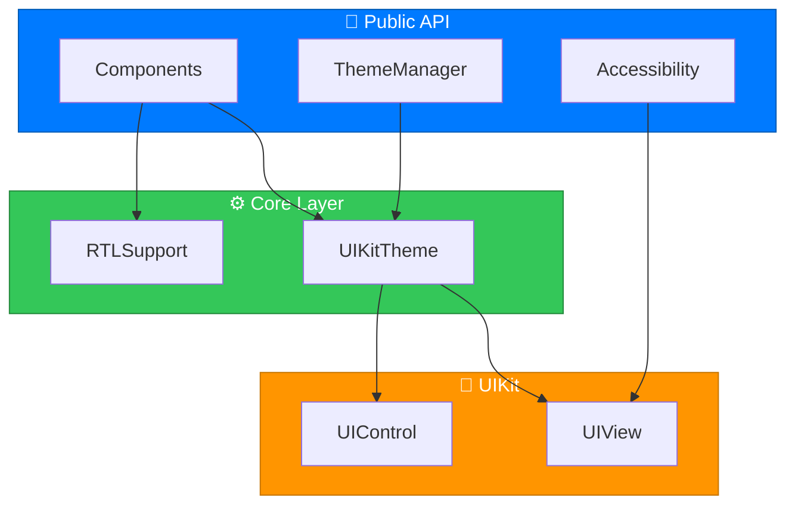

```
    ╦╔═╗╔═╗  ╦ ╦╦  ╔═╗╔═╗╔╦╗╔═╗╔═╗╔╗╔╔═╗╔╗╔╔╦╗╔═╗
    ║║ ║╚═╗  ║ ║║  ║  ║ ║║║║╠═╝║ ║║║║║╣ ║║║ ║ ╚═╗
    ╩╚═╝╚═╝  ╚═╝╩  ╚═╝╚═╝╩ ╩╩  ╚═╝╝╚╝╚═╝╝╚╝ ╩ ╚═╝
```

<p align="center">
  <strong>🎨 The Most Comprehensive UIKit Component Library for iOS</strong>
</p>

<p align="center">
  <a href="https://swift.org"></a>
  <a href="https://developer.apple.com/ios/"></a>
  <a href="https://developer.apple.com/xcode/"></a>
  <a href="LICENSE"></a>
</p>

<p align="center">
  <a href="https://github.com/muhittincamdali/iOSUIComponents/actions"></a>
  <a href="https://swift.org/package-manager/"></a>
  <a href="https://cocoapods.org/pods/iOSUIComponents"></a>
  <a href="https://github.com/muhittincamdali/iOSUIComponents/stargazers"></a>
</p>

---

## 🎯 Overview

**50+ production-ready UIKit components** with full Interface Builder support, accessibility compliance, RTL support, and comprehensive theming system. Built for professional iOS development.

```
╭─────────────────────────────────────────────────────────────╮
│  ✓ 100% UIKit Native         ✓ @IBDesignable/@IBInspectable │
│  ✓ WCAG 2.1 Accessible       ✓ RTL Language Support         │
│  ✓ Comprehensive Theming     ✓ Zero Dependencies            │
│  ✓ Production Tested         ✓ Storyboard & Programmatic    │
╰─────────────────────────────────────────────────────────────╯
```

---

## 📦 Component Categories

| Category | Count | Components |
|:---------|:-----:|:-----------|
| **🔘 Buttons** | 15 | Primary, Secondary, Tertiary, Destructive, Success, Warning, Gradient, Icon, Pill, FAB, Social, Loading, Chip, Toggle, Segmented |
| **⌨️ Text Fields** | 9 | Outlined, Filled, Underlined, Floating Label, Search, Password, OTP, Phone, Amount |
| **📋 Table Cells** | 6 | Standard, Profile, Settings, Swipeable, Card, Section Header |
| **🎨 Collection** | 7 | Waterfall, Carousel, Sticky Header, Grid, Image Cell, Product Cell, Tag Cell |
| **🧭 Navigation** | 4 | Navigation Bar, Tab Bar, Breadcrumbs, Page Control |
| **💬 Feedback** | 8 | Alert, Action Sheet, Toast, Badge, Progress Bar, Circular Progress, Step Progress, Range Slider |
| **📊 States** | 6 | Skeleton, Empty State, Error State, Pull to Refresh, Infinite Scroll |

---

## 🔘 Button Components

```
┌────────────────────────────────────────────────────────────────┐
│                                                                │
│    ╔═══════════════════════╗    ┌───────────────────────┐     │
│    ║    Primary Button     ║    │   Secondary Button    │     │
│    ╚═══════════════════════╝    └───────────────────────┘     │
│                                                                │
│    ╔══════════╗   ╔══════════╗   ╔══════════╗                 │
│    ║ 🔴 Error ║   ║ 🟢 Ok   ║   ║ 🟡 Warn  ║                 │
│    ╚══════════╝   ╚══════════╝   ╚══════════╝                 │
│                                                                │
│    [♥ Icon]    [⟳ Loading...]    [ + FAB ]                   │
│                                                                │
│    ┌──────────────────────────────────────────────────┐       │
│    │░░░░░░░░░░░ Gradient Button ░░░░░░░░░░░│          │       │
│    └──────────────────────────────────────────────────┘       │
│                                                                │
│    [  Sign in with Apple  ]  [Sign in with Google]            │
│                                                                │
└────────────────────────────────────────────────────────────────┘
```

### Usage

```swift
// Primary button
let primaryBtn = PrimaryButton()
primaryBtn.setTitle("Get Started", for: .normal)

// Loading button with state
let loadingBtn = LoadingButton()
loadingBtn.setTitle("Submit", for: .normal)
loadingBtn.startLoading()  // Shows spinner
loadingBtn.stopLoading()   // Restores title

// Gradient button
let gradientBtn = GradientButton()
gradientBtn.startColor = .systemPurple
gradientBtn.endColor = .systemBlue
gradientBtn.setTitle("Premium", for: .normal)

// Floating Action Button
let fab = FloatingActionButton()
fab.setImage(UIImage(systemName: "plus"), for: .normal)

// Social login buttons
let appleBtn = SocialButton()
appleBtn.configure(for: .apple, title: "Sign in with Apple")
```

### Interface Builder

All buttons are `@IBDesignable` with `@IBInspectable` properties:

| Property | Type | Description |
|----------|------|-------------|
| `cornerRadius` | CGFloat | Corner radius |
| `borderWidth` | CGFloat | Border width |
| `borderColor` | UIColor | Border color |
| `normalBackgroundColor` | UIColor | Normal state background |
| `highlightedBackgroundColor` | UIColor | Highlighted state background |
| `shadowRadius` | CGFloat | Shadow blur radius |
| `shadowOpacity` | Float | Shadow opacity |

---

## ⌨️ Text Field Components

```
┌────────────────────────────────────────────────────────────┐
│                                                            │
│   ┌──────────────────────────────────────────────────┐    │
│   │  📧  Outlined Text Field                    ✓    │    │
│   └──────────────────────────────────────────────────┘    │
│                                                            │
│   Email Address                                            │
│   ▔▔▔▔▔▔▔▔▔▔▔▔▔▔▔▔▔▔▔▔▔▔▔▔▔▔▔▔▔▔▔▔▔▔▔▔                    │
│   │  Floating Label Field                           │    │
│   ▁▁▁▁▁▁▁▁▁▁▁▁▁▁▁▁▁▁▁▁▁▁▁▁▁▁▁▁▁▁▁▁▁▁▁▁                    │
│                                                            │
│   ┌──────────────────────────────────────────────────┐    │
│   │  🔍  Search products...                     ✕    │    │
│   └──────────────────────────────────────────────────┘    │
│                                                            │
│   ┌──────────────────────────────────────────────────┐    │
│   │  🔒  ••••••••••••                           👁   │    │
│   └──────────────────────────────────────────────────┘    │
│                                                            │
│   ┌────┐ ┌────┐ ┌────┐ ┌────┐ ┌────┐ ┌────┐              │
│   │  4 │ │  2 │ │  9 │ │  1 │ │  _  │ │  _  │  OTP       │
│   └────┘ └────┘ └────┘ └────┘ └────┘ └────┘              │
│                                                            │
│   +1  ┌──────────────────────────────────────────┐        │
│       │  (555) 123-4567                          │        │
│       └──────────────────────────────────────────┘        │
│                                                            │
└────────────────────────────────────────────────────────────┘
```

### Usage

```swift
// Floating label text field
let emailField = FloatingLabelTextField()
emailField.floatingLabelText = "Email Address"
emailField.placeholder = "Enter your email"

// Password field with visibility toggle
let passwordField = PasswordTextField()
passwordField.placeholder = "Enter password"

// Search field
let searchField = SearchTextField()
searchField.placeholder = "Search products..."

// OTP input
let otpField = OTPTextField()
otpField.numberOfDigits = 6
otpField.onComplete = { code in
    print("Entered OTP: \(code)")
}

// Phone number with formatting
let phoneField = PhoneNumberTextField()
phoneField.countryCode = "+1"
phoneField.format = "(###) ###-####"

// Currency amount
let amountField = AmountTextField()
amountField.currencySymbol = "$"
amountField.allowDecimals = true
```

---

## 📋 Table View Cells

```
┌─────────────────────────────────────────────────────────────┐
│                                                             │
│  ┌─────────────────────────────────────────────────────┐   │
│  │  ┌───┐                                              │   │
│  │  │ 📦│  Standard Cell Title                     >   │   │
│  │  └───┘  Subtitle text goes here                     │   │
│  └─────────────────────────────────────────────────────┘   │
│                                                             │
│  ┌─────────────────────────────────────────────────────┐   │
│  │  ┌───┐   John Smith              ●                  │   │
│  │  │ 👤│   Online now                                 │   │
│  │  └───┘                                              │   │
│  └─────────────────────────────────────────────────────┘   │
│                                                             │
│  ┌─────────────────────────────────────────────────────┐   │
│  │  ⚙️   Notifications                          [ON]   │   │
│  └─────────────────────────────────────────────────────┘   │
│                                                             │
│  ┌─────────────────────────────────────────────────────┐   │
│  │  ╔═══════════════════════════════════════════════╗  │   │
│  │  ║            Card Cell Image                    ║  │   │
│  │  ╚═══════════════════════════════════════════════╝  │   │
│  │  Card Title                                         │   │
│  │  Description text...          [ Action Button ]     │   │
│  └─────────────────────────────────────────────────────┘   │
│                                                             │
└─────────────────────────────────────────────────────────────┘
```

### Usage

```swift
// Register cells
tableView.registerStandardCells()

// Standard cell
let cell = tableView.dequeueReusableCell(
    withIdentifier: StandardCell.reuseIdentifier
) as! StandardCell
cell.configure(
    title: "Settings",
    subtitle: "Manage your preferences",
    image: UIImage(systemName: "gear"),
    showAccessory: true
)

// Profile cell
let profileCell = tableView.dequeueReusableCell(
    withIdentifier: ProfileCell.reuseIdentifier
) as! ProfileCell
profileCell.configure(
    name: "John Smith",
    status: "iOS Developer",
    avatar: avatarImage,
    isOnline: true
)

// Settings cell with toggle
let settingsCell = tableView.dequeueReusableCell(
    withIdentifier: SettingsCell.reuseIdentifier
) as! SettingsCell
settingsCell.configureToggle(
    icon: UIImage(systemName: "bell.fill"),
    iconColor: .systemRed,
    title: "Notifications",
    isOn: true
)
settingsCell.onToggleChange = { isOn in
    print("Notifications: \(isOn)")
}
```

---

## 🎨 Collection View Layouts

### Waterfall (Pinterest-style)

```
┌─────────────────────────────────────┐
│  ┌─────────┐  ┌─────────┐          │
│  │         │  │         │          │
│  │   📸    │  │         │          │
│  │         │  │   📸    │          │
│  └─────────┘  │         │          │
│  ┌─────────┐  │         │          │
│  │         │  └─────────┘          │
│  │   📸    │  ┌─────────┐          │
│  └─────────┘  │   📸    │          │
│               └─────────┘          │
└─────────────────────────────────────┘
```

### Carousel

```
┌─────────────────────────────────────┐
│                                     │
│   ┌───┐  ╔═══════════╗  ┌───┐      │
│   │   │  ║           ║  │   │      │
│   │ ◄ │  ║  FOCUSED  ║  │ ► │      │
│   │   │  ║           ║  │   │      │
│   └───┘  ╚═══════════╝  └───┘      │
│                                     │
│              ● ○ ○ ○                │
└─────────────────────────────────────┘
```

### Usage

```swift
// Waterfall layout
let waterfallLayout = WaterfallLayout()
waterfallLayout.numberOfColumns = 2
waterfallLayout.cellPadding = 8
waterfallLayout.delegate = self

let collectionView = UICollectionView(
    frame: .zero,
    collectionViewLayout: waterfallLayout
)

// Carousel layout
let carouselLayout = CarouselLayout()
carouselLayout.itemSize = CGSize(width: 280, height: 350)
carouselLayout.itemScale = 0.85  // Scale for non-focused items
carouselLayout.itemAlpha = 0.6  // Alpha for non-focused items

// Grid layout
let gridLayout = GridLayout()
gridLayout.columns = 3
gridLayout.cellSpacing = 4
```

---

## 🧭 Navigation Components

```
┌─────────────────────────────────────────────────────────────┐
│  ←   Settings                                    ⚙️  🔔     │
│─────────────────────────────────────────────────────────────│
│                                                             │
│  Home  >  Products  >  Electronics  >  Phones              │
│                                                             │
│                                                             │
│─────────────────────────────────────────────────────────────│
│                                                             │
│     🏠           🔍           ❤️           👤              │
│    Home        Search      Favorites     Profile           │
│     ●            ○            ○            ○               │
│                                                  (2)       │
└─────────────────────────────────────────────────────────────┘
```

### Usage

```swift
// Custom navigation bar
let navBar = CustomNavigationBar()
navBar.title = "Settings"
navBar.setBackButton { [weak self] in
    self?.navigationController?.popViewController(animated: true)
}
navBar.setRightButton(icon: "gear") {
    // Show settings
}

// Custom tab bar
let tabBar = CustomTabBar()
tabBar.items = [
    TabBarItem(icon: "house", selectedIcon: "house.fill", title: "Home"),
    TabBarItem(icon: "magnifyingglass", title: "Search"),
    TabBarItem(icon: "heart", selectedIcon: "heart.fill", title: "Favorites"),
    TabBarItem(icon: "person", selectedIcon: "person.fill", title: "Profile")
]
tabBar.onTabSelected = { index in
    print("Selected tab: \(index)")
}
tabBar.setBadgeCount(2, at: 3)  // Show badge on profile tab

// Breadcrumb navigation
let breadcrumb = BreadcrumbView()
breadcrumb.crumbs = [
    .init(title: "Home") { /* navigate */ },
    .init(title: "Products") { /* navigate */ },
    .init(title: "Electronics")  // Current (no action)
]

// Page control
let pageControl = CustomPageControl()
pageControl.numberOfPages = 5
pageControl.currentPage = 0
pageControl.onPageChange = { page in
    // Scroll to page
}
```

---

## 💬 Feedback Components

### Alerts

```
       ┌─────────────────────────────────────┐
       │                                     │
       │              ✅                     │
       │                                     │
       │         Success!                    │
       │                                     │
       │   Your changes have been saved      │
       │   successfully.                     │
       │                                     │
       │   ┌─────────────────────────────┐   │
       │   │           OK                │   │
       │   └─────────────────────────────┘   │
       │                                     │
       └─────────────────────────────────────┘
```

### Toast

```
┌─────────────────────────────────────────────────────────────┐
│  ┌─────────────────────────────────────────────────────┐   │
│  │  ✓  Changes saved successfully                   ✕  │   │
│  └─────────────────────────────────────────────────────┘   │
│                                                             │
│                      Content Area                           │
│                                                             │
└─────────────────────────────────────────────────────────────┘
```

### Usage

```swift
// Show alert
AlertView.showSuccess(
    title: "Success!",
    message: "Your profile has been updated.",
    in: view
)

// Confirmation alert
AlertView.showConfirm(
    title: "Delete Item?",
    message: "This action cannot be undone.",
    in: view,
    confirmTitle: "Delete",
    cancelTitle: "Cancel",
    onConfirm: { deleteItem() }
)

// Toast notification
ToastView.show(
    style: .success,
    message: "Changes saved successfully",
    in: view,
    position: .top
)

// Action sheet
let actionSheet = ActionSheet()
actionSheet.configure(
    title: "Share",
    message: "How would you like to share?",
    actions: [
        .init(title: "Copy Link", icon: "link"),
        .init(title: "Share via Email", icon: "envelope"),
        .init(title: "Delete", style: .destructive, icon: "trash"),
        .init(title: "Cancel", style: .cancel)
    ]
)
actionSheet.show(in: view)
```

---

## 📊 Progress & Sliders

```
┌─────────────────────────────────────────────────────────────┐
│                                                             │
│   Progress Bar                                              │
│   ████████████████░░░░░░░░░░░░░░░░░░░░░░░░░  45%          │
│                                                             │
│               ┌─────────┐                                   │
│              ╱           ╲                                  │
│             │     72%     │     Circular Progress           │
│              ╲           ╱                                  │
│               └─────────┘                                   │
│                                                             │
│   Step Progress                                             │
│   (1)───●───(2)───●───(3)───○───(4)───○───(5)             │
│                                                             │
│   Custom Slider                                             │
│   ○────────●────────────────────────○   35                 │
│                                                             │
│   Range Slider                                              │
│   ○────●════════════════●────────────○   $25 - $75        │
│                                                             │
└─────────────────────────────────────────────────────────────┘
```

### Usage

```swift
// Linear progress
let progressBar = ProgressBar()
progressBar.progress = 0.45
progressBar.progressColor = .systemBlue
progressBar.showsPercentage = true

// Circular progress
let circularProgress = CircularProgressView()
circularProgress.progress = 0.72
circularProgress.lineWidth = 10
circularProgress.showsValue = true

// Step progress
let stepProgress = StepProgressView()
stepProgress.numberOfSteps = 5
stepProgress.currentStep = 2
stepProgress.stepTitles = ["Cart", "Shipping", "Payment", "Review", "Done"]

// Custom slider
let slider = CustomSlider()
slider.minimumValue = 0
slider.maximumValue = 100
slider.value = 35
slider.showsValue = true
slider.addTarget(self, action: #selector(sliderChanged), for: .valueChanged)

// Range slider
let rangeSlider = RangeSlider()
rangeSlider.minimumValue = 0
rangeSlider.maximumValue = 100
rangeSlider.lowerValue = 25
rangeSlider.upperValue = 75
```

---

## 📊 State Views

### Skeleton Loading

```
┌─────────────────────────────────────────────────────────────┐
│  ░░░░░░░░░░░░░░░░░░░░░░░░░░░░░░░░░░░░░░░░░░░░░░░░░░░░░░░  │
│  ░░░░░░░░░░░░░░░░░░░░░░░░░░░░░░░░░░░░░░░░░░░░░░░░░░░░░░░  │
│                                                             │
│  ┌────┐  ░░░░░░░░░░░░░░░░░░░░░░░░░░░░░░░                   │
│  │ ░░ │  ░░░░░░░░░░░░░░░░░░░░░░░░                          │
│  └────┘                                                     │
│  ┌────┐  ░░░░░░░░░░░░░░░░░░░░░░░░░░░░░░░                   │
│  │ ░░ │  ░░░░░░░░░░░░░░░░░░░░░░░░                          │
│  └────┘                                                     │
│  ┌────┐  ░░░░░░░░░░░░░░░░░░░░░░░░░░░░░░░                   │
│  │ ░░ │  ░░░░░░░░░░░░░░░░░░░░░░░░                          │
│  └────┘                                                     │
└─────────────────────────────────────────────────────────────┘
```

### Empty State

```
┌─────────────────────────────────────────────────────────────┐
│                                                             │
│                         📦                                  │
│                                                             │
│                    No Data                                  │
│                                                             │
│              There's nothing here yet.                      │
│                                                             │
│                    [ Refresh ]                              │
│                                                             │
└─────────────────────────────────────────────────────────────┘
```

### Usage

```swift
// Skeleton loading
let skeleton = SkeletonContainer()
skeleton.configure(layout: .list)
skeleton.startAnimating()
// When data loads:
skeleton.stopAnimating()
skeleton.removeFromSuperview()

// Empty state
let emptyView = EmptyStateView()
emptyView.configure(
    image: UIImage(systemName: "tray"),
    title: "No Messages",
    message: "You don't have any messages yet.",
    actionTitle: "Compose",
    action: { /* compose message */ }
)

// Error state
let errorView = ErrorStateView()
errorView.configure(
    type: .network,
    title: "Connection Error",
    message: "Please check your internet connection.",
    primaryActionTitle: "Retry",
    primaryAction: { /* retry */ }
)

// Pull to refresh
let refreshControl = PullToRefreshControl()
refreshControl.refreshingMessage = "Updating..."
tableView.refreshControl = refreshControl

// Infinite scroll
let infiniteScroll = InfiniteScrollController(scrollView: tableView)
infiniteScroll.onLoadMore = {
    // Load more data
    infiniteScroll.finishLoading(hasMore: true)
}
tableView.tableFooterView = infiniteScroll.createFooterView(width: tableView.bounds.width)
```

---

## 🎨 Theming System

```swift
// Apply default theme
ThemeManager.shared.applyTheme(DefaultTheme.shared)

// Apply dark theme
ThemeManager.shared.applyTheme(DarkTheme.shared)

// Create custom theme
struct CustomTheme: UIKitTheme {
    var primaryColor: UIColor { UIColor(hex: "#6C63FF") }
    var secondaryColor: UIColor { .systemGray }
    var accentColor: UIColor { UIColor(hex: "#FF6584") }
    var backgroundColor: UIColor { .white }
    var surfaceColor: UIColor { UIColor(hex: "#F8F9FA") }
    var errorColor: UIColor { .systemRed }
    var successColor: UIColor { .systemGreen }
    var warningColor: UIColor { .systemOrange }
    var textPrimaryColor: UIColor { UIColor(hex: "#1A1A2E") }
    var textSecondaryColor: UIColor { .secondaryLabel }
    var borderColor: UIColor { UIColor(hex: "#E0E0E0") }
    var shadowColor: UIColor { UIColor.black.withAlphaComponent(0.1) }
    
    var fontRegular: UIFont { .systemFont(ofSize: 16) }
    var fontMedium: UIFont { .systemFont(ofSize: 16, weight: .medium) }
    var fontSemibold: UIFont { .systemFont(ofSize: 16, weight: .semibold) }
    var fontBold: UIFont { .systemFont(ofSize: 16, weight: .bold) }
    
    var cornerRadiusSmall: CGFloat { 4 }
    var cornerRadiusMedium: CGFloat { 8 }
    var cornerRadiusLarge: CGFloat { 16 }
    
    // ... other properties
}

ThemeManager.shared.applyTheme(CustomTheme())
```

### Listen for Theme Changes

```swift
NotificationCenter.default.addObserver(
    self,
    selector: #selector(themeDidChange),
    name: .themeDidChange,
    object: nil
)
```

---

## ♿ Accessibility

All components are built with comprehensive accessibility support:

```
┌─────────────────────────────────────────────────────────────┐
│  Accessibility Features                                     │
├─────────────────────────────────────────────────────────────┤
│  ✓ VoiceOver labels, hints, and traits                     │
│  ✓ Dynamic Type support (all text scales)                  │
│  ✓ Sufficient color contrast (WCAG 2.1 AA)                 │
│  ✓ Touch targets ≥ 44pt                                    │
│  ✓ Reduce Motion support                                   │
│  ✓ Bold Text support                                       │
│  ✓ Smart Invert compatible                                 │
└─────────────────────────────────────────────────────────────┘
```

### Usage

```swift
// Check accessibility settings
if AccessibilityHelper.isVoiceOverRunning {
    // Adjust UI for VoiceOver
}

if AccessibilityHelper.isReduceMotionEnabled {
    // Disable animations
}

// Announce changes
AccessibilityHelper.announce("Item deleted")

// Configure accessibility
button.accessible(
    label: "Submit form",
    hint: "Double tap to submit your information",
    traits: .button
)

// Check color contrast
let passes = ContrastChecker.meetsWCAG_AA(
    foreground: .white,
    background: .systemBlue
)
```

---

## 🌍 RTL Support

Full Right-to-Left language support:

```swift
// Check if RTL
if RTLSupport.isRTL {
    // Adjust layout
}

// Flip image for RTL
let flippedImage = RTLSupport.mirrorImage(originalImage)

// RTL-aware edge insets
let insets = UIEdgeInsets.rtlAware(
    top: 8,
    leading: 16,
    bottom: 8,
    trailing: 8
)

// Configure views for RTL
button.configureForRTL()
label.configureForRTL()
stackView.configureForRTL()
```

---

## 📲 Installation

### Swift Package Manager

```swift
dependencies: [
    .package(
        url: "https://github.com/muhittincamdali/iOSUIComponents.git",
        from: "2.0.0"
    )
]
```

### CocoaPods

```ruby
pod 'iOSUIComponents', '~> 2.0'
```

### Manual

1. Clone the repository
2. Drag `Sources` folder into your project
3. Import the module

---

## 📁 Project Structure

```
iOSUIComponents/
├── Sources/
│   ├── Core/
│   │   ├── UIKitTheme.swift          # Theme protocol & implementations
│   │   ├── Accessibility.swift        # Accessibility helpers
│   │   └── RTLSupport.swift           # RTL language support
│   ├── ButtonComponents/
│   │   └── UIKitButtons.swift         # 15 button variants
│   ├── InputComponents/
│   │   └── UIKitTextFields.swift      # 9 text field variants
│   ├── ListComponents/
│   │   ├── UIKitTableViewCells.swift  # Table view cells
│   │   └── UIKitCollectionViews.swift # Collection views & layouts
│   ├── NavigationComponents/
│   │   └── UIKitNavigation.swift      # Navigation components
│   ├── FeedbackComponents/
│   │   ├── UIKitAlerts.swift          # Alerts, toasts, badges
│   │   ├── UIKitProgress.swift        # Progress views, sliders
│   │   └── UIKitStates.swift          # Skeleton, empty, error states
│   └── iOSUIComponents.swift          # Main export file
├── Examples/
├── Tests/
└── Documentation/
```

---

## 📋 Requirements

| Requirement | Version |
|-------------|---------|
| iOS | 15.0+ |
| Xcode | 15.0+ |
| Swift | 5.9+ |

---

## 🏗️ Architecture



---

## 🤝 Contributing

Contributions are welcome! Please read [CONTRIBUTING.md](CONTRIBUTING.md).

1. Fork the repository
2. Create feature branch (`git checkout -b feature/amazing-feature`)
3. Commit changes (`git commit -m 'feat: add amazing feature'`)
4. Push to branch (`git push origin feature/amazing-feature`)
5. Open a Pull Request

---

## 📄 License

MIT License - see [LICENSE](LICENSE) for details.

---

## 👨‍💻 Author

**Muhittin Camdali** — [@muhittincamdali](https://github.com/muhittincamdali)

---

<p align="center">
  <sub>If you find this helpful, consider giving it a ⭐</sub>
</p>

---

## 📈 Star History

<a href="https://star-history.com/#muhittincamdali/iOSUIComponents&Date">
 <picture>
   <source media="(prefers-color-scheme: dark)" srcset="https://api.star-history.com/svg?repos=muhittincamdali/iOSUIComponents&type=Date&theme=dark" />
   <source media="(prefers-color-scheme: light)" srcset="https://api.star-history.com/svg?repos=muhittincamdali/iOSUIComponents&type=Date" />
   
 </picture>
</a>
